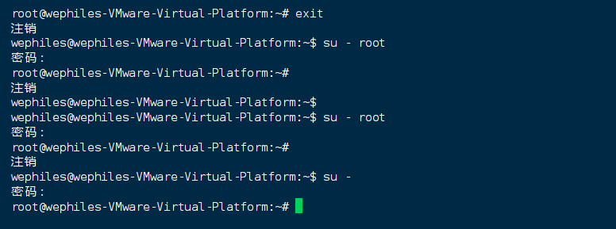
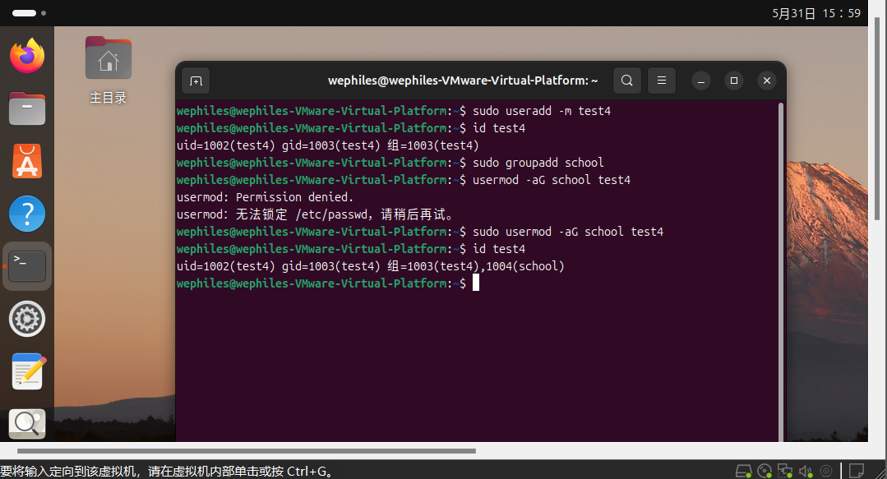
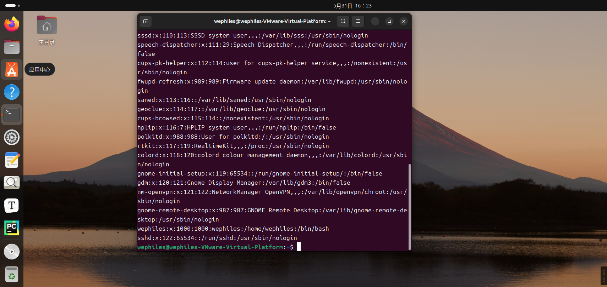
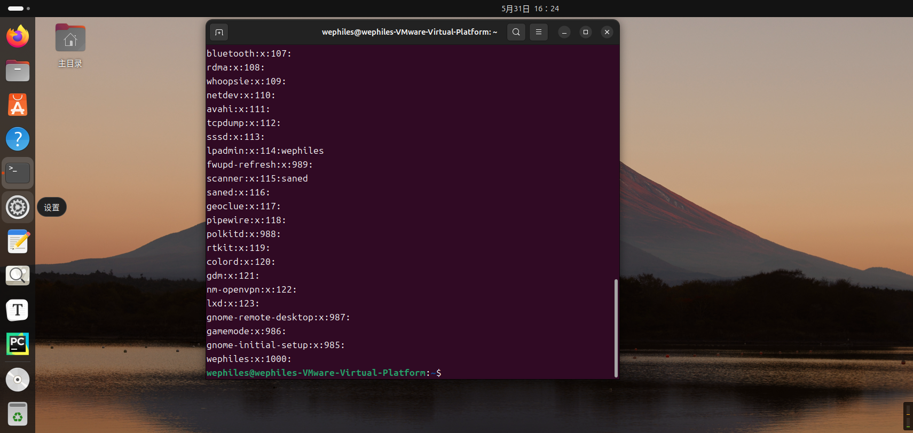

[TOC]

# `linux`用户和权限

- 认知`root`用户
- 用户、用户组管理
- 查看权限控制
- 修改权限控制`chmod`
- 修改权限控制`chown`

# 1 `root`用户

## 1.1 什么是`root`用户

- 在`linux`中，拥有最大权限的账户名为`root`(超级管理员).
- 而在前期,我们一直使用的账户是我们普通的账户.
- `root`用户拥有系统最大的操作权限,而普通用户在许多地方的权限是受限的. 比如无法在普通用户权限下,在`/`下创建新文件夹是不允许的,但是在`root`用户下是可以的.
  
- 普通用户的权限,一般在`home`目录内是不受限的
- 一旦出了`home`目录,大多数地方,普通股用户只有只读和执行权限,没有修改权限

## 1.2 掌握用户切换命令

通过`su`命令切换到`root`账户

`su`命令就是用户账户切换的系统命令,其来源于英文单词`switch user`

语法:`~$ su [-] 用户名`

- 符号是可选的,表示是否在切换用户后加载环境变量(后续会讲解)建议带上.
- 参数:用户名,表示要切换的用户,也可以省略,省略表示切换到`root`
- 切换用户后,可以通过`exit`命令退回到上一个用户,也可以使用快捷键`ctrl+D`
- 使用普通用户,切换到其他用户需要输入密码,例如切换到`root`用户
- 使用`root`用户切换到其他用户无需密码,可以直接切换.

## 1.3 掌握`sudo`命令

当我们得知`root`密码的时候,可以使用素命令切换到`root`得到最大权限

但是我们不建议长期使用`root`用户,避免给系统带来的损坏.

我们可以使用`sudo`命令,为普通的命令授权,临时以`root`身份执行.

语法:

`~$ sudo 其他命令`

- 在执行其他命令之前,带上`sudo`,即可为这一条命令临时赋予`root`授权
- 但是并不是所有用户都有权利使用`sudo`命令,我们需要给普通用户配置`sudo`认证.

## 1.4 为普通用户配置`sudo`认证

- 切换到`root`用户,执行`visudo`,会自动通过`vi`编辑器打开`/etc/sudoers`
- 在文件的最后添加:`用户名 ALL=(ALL) NOPASSWORD:ALL`
- 通过`wq`保存并退出

# 2 用户、用户组管理

## 2.1 用户和用户组

`Linux`系统中可以:

- 配置多个用户
- 配置多个用户组
- 用户可加入多个用户组中

`Linux`针对权限管控,有两个级别:

- 针对用户的权限控制
- 针对用户组的权限控制

比如,针对某个文件,可以控制用户的权限,也可以控制用户组的权限

所以,我们需要学习在`Linux`中进行用户/用户组管理的基础命令,为后面学习权限控制打下基础.

## 2.2 管理用户、用户组的命令

### 2.2.1 用户组管理

以下命令需要`root`用户执行:

- 创建用户组:`groupadd 用户组名`
- 删除用户组:`groupdel 用户组名`

我们创建一个`school`用户组:

`gropuadd school`

### 2.2.2 用户管理

以下命令需要`root`用户执行

- 创建用户
  `useradd [-g -d] 用户名`
  - 选项 `-g` 指定用户的组,不指定`-g`,会创建同名组并自动加入,指定`-g`需要组已经存在,如果已经存在同名组,必须使用`-g`
  - 选项 `-d` 指定用户`home`路径,不指定,`home`目录默认在:`/home/用户名` --- 注意,新版的这个选项改成`-m`了
- 删除用户
  `userdel [-r] 用户名`
  - 选项 `-r`,删除用户的`home`目录,不适用`-r`,删除用户时,`home`目录保留.
- 查看用户所属组
  `id [用户名]`
  - 参数: 用户名,被查看的用户,如果不提供则查看自身
- 修改用户所属组
  `usermod -aG 用户组 用户名` 将指定用户加入指定用户组.
  

### 2.2.3 `getent`命令

#### 2.2.3.1 查看有哪些成员

`getent`命令可以查看当前系统中有哪些用户

语法:`getent passwd`

信息共有七份:

`用户名:密码(x):用户ID:组ID:描述信息(无用):HOME目录:执行终端(默认bash)`

#### 2.2.3.2 查看有哪些组

`getent group`

# 3 查看权限控制

## 3.1 查看`Linux`的权限管控信息

通过`ls -l`可以以列表的形式去查看内容,并显示权限细节

- 序号1,表示文件/文件夹的权限控制信息
- 序号2,表示文件/文件夹的所属用户
- 序号3,表示文件.文件夹所属用户组

### 3.1.1 认知权限细节

序号1这些权限的细节:

举例:`drwxr-xr-x`:

- 这是一个文件夹(`d`)
  - 所属用户(序号2)的权限是:有`r`有`w`有`x`,`rwx`
  - 所属用户组(序号3)的权限是:有`r`无`w`有`x`,`r-x`
  - 其他用户的权限是:有`r`无`w`有`x`,`r-x`

## 3.2 掌握读、写、执行三种权限的含义

`rwx`

- `r`代表`read`,读权限
- `w`代表`write`,写权限
- `x`代表执行权限

针对文件或者文件夹的不同,`rwx`的含义有细微差别

- `r`
  - 针对文件可以查看内容
  - 针对文件夹可以查看文件夹内容 比如`ls`命令
- `w`
  - 针对文件表示可以修改此文件
  - 针对文件夹表示可以在文件夹内创建、删除、改名等操作
- `x`
  - 针对文件表示可以将文件作为可执行文件
  - 针对文件夹,表示可以更改工作目录到此文件夹,即`cd`进入

# 4 修改权限控制`chmod`

## 4.1 `chmod`命令

我们可以使用`chmod`命令修改文件和文件夹的权限信息

> [!Caution]
>
> 注意,只有文件、文件夹的所属用户或者`root`用户才可以修改。

语法：

`~$ chmod [-R] 权限 文件或者文件夹`

- 选项 `-R`:对文件夹内的全部内容应用同样的操作

举例：

- `chmod u=rwx,g=rx,o=x hello.txt` -- 将文件的权限修改为`rwxr-x--x`
  - 其中`u`表示`user`所属用户权限，`g`表示`group`组权限，`o`代表`other`其他用户权限
- `chmod -R u=rwx,g=rx,o=x test` -- 将文件夹`test`及文件夹下所有内容的权限修改为`rwxr-x--x`
- 除此之外，还有快捷写法：`chmod 751 hello.txt`

## 4.2 权限的数字序号

权限可以用三位数字来表示,第一位数字表示用户权限,第二位表示组权限,第三位表示其他用户权限,,数字的细节如下:

`r`记为`4`,`w`记为`2`,`x`记为`1`.

- 0:无任何权限 即`---`
- 1:仅有`x`权限 即`--x`
- 2仅有`w`权限 即`-w-`
- 3:有`w`和`x`权限 即`-wx`
- 4:仅有`r`权限 即`r--`
- 5:有`r`和`x`权限 即`r-x`
- 6:有`r`和`w`权限 即`rw-`
- 7:有全部权限 即`rwx`

# 5 修改权限控制`chown`

`chown`可以修改文件 文件夹的所属用户和所属用户组;

普通用户无法修改所属为其他用户或组,所以此命令只适用于`root`用户执行;

语法:`~$ chown [-R] [用户][:][用户组] 文件或文件夹`

- 选项 `-R` 同`chmod`,对文件夹内所有内容应用同样规则;
- 选项`[用户]`:修改所属用户;
- 选项`[用户组]`:修改所属用户组;
- `:`用于分隔用户和用户组;

示例:

- `chown root hello.txt` -- 将`hello.txt`所属用户修改为`root`;
- `chown :root hello.txt` -- 将`hello.txt`所属用户组修改为`root`;
- `chown root:wephiles hello.txt` -- 将`hello.txt`所属用户修改为`root`,用户组修改为`wephiles`;
- `chown -R root test` -- 将文件夹`test`的你所属用户改为`root`并对文件夹内全部内容应用同样规则; 

 

